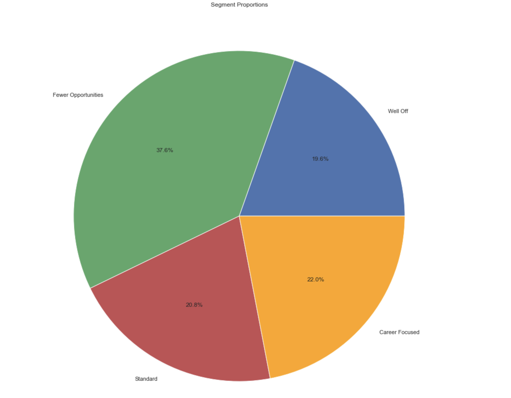
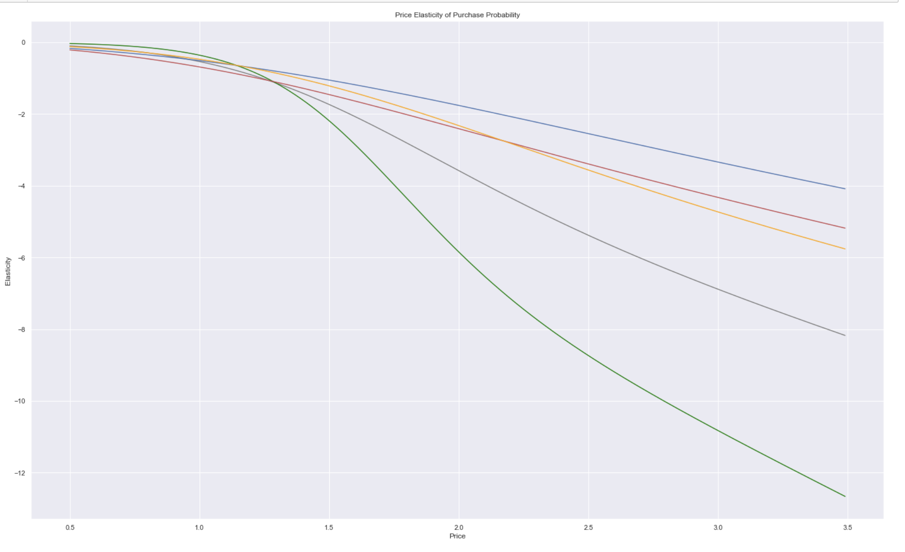
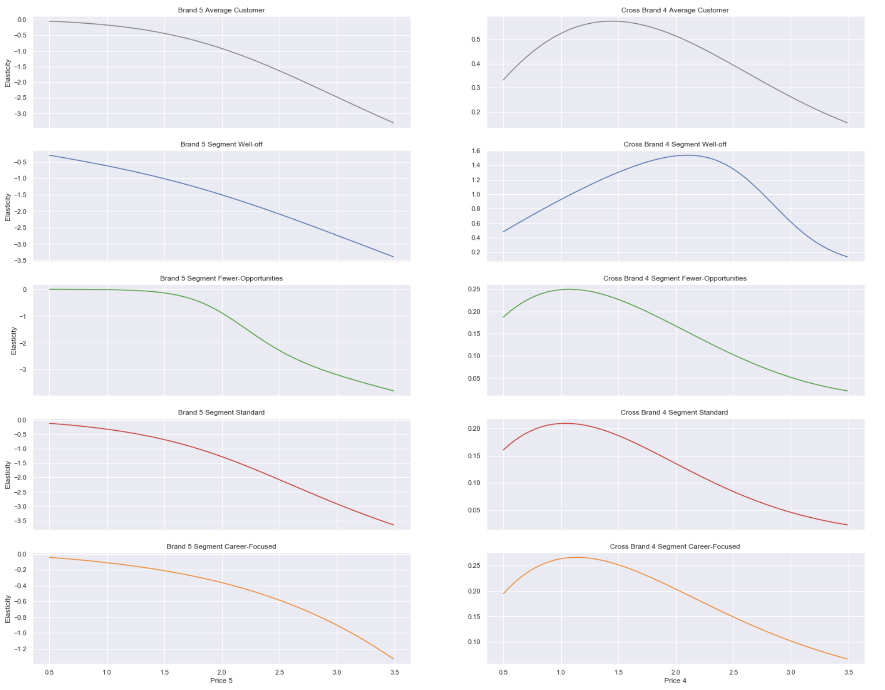
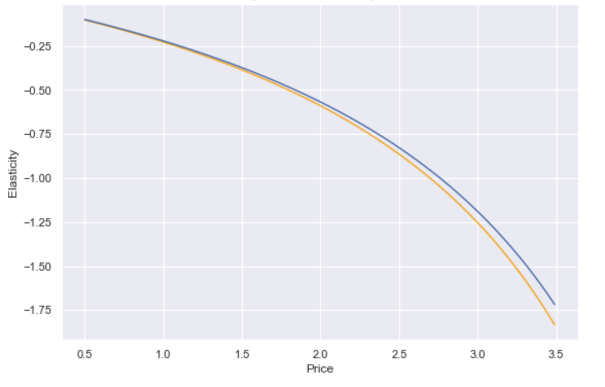

# Prediction of purchase probability of customers
### TensorFlow, Keras, Scikit-Learn, DeepLearning

# Check my presentation in link below:
https://www.loom.com/share/6fd86245308e4f128d3a3ed4f0e5fe60

-----------------------------

# The demo

-----------------------------

# Customer Segments

-----------------------------

# Price elasticity of purchase probability

-----------------------------

# Purchase elasticity of each segment

-----------------------------

# Price elasticity of purchase quntity

